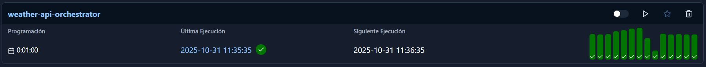
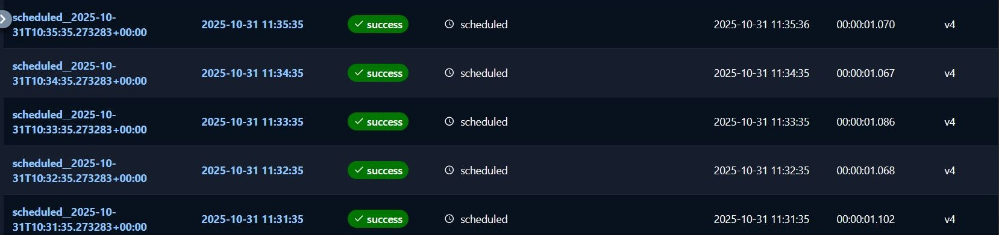
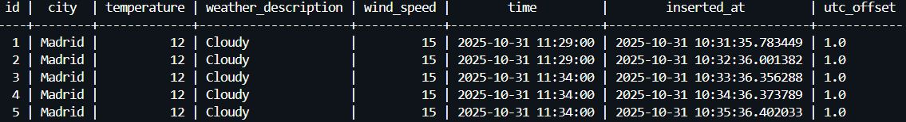

<h1 align="center"> ⛈️ Weather Data Pipeline </h1>

Desarrollo de un pipeline automatizado de datos meteorológicos que extrae información del clima desde la API Weatherstack. Mediante Apache Airflow, los datos se almacenan de forma periódica en una base de datos PostgreSQL, asegurando la actualización continua de la información. Todo el sistema se ejecuta de manera aislada y reproducible dentro de un contenedor Docker, facilitando su despliegue y mantenimiento.

<h2> ● Pasos: </h2>

1. En la terminal introducimos el comando "docker-compose up".

2. Acceder a "http://localhost:8000/dags/weather-api-orchestrator/runs". 

3. Introducir el usuario "admin" y la contraseña generada por Airflow.

  

4. Ponemos en funcionamiento nuestro Pipeline. Este se ejecutará de forma automática cada minuto.

  

5. Abrimos una nueva terminal e introducimos el comando "docker-compose exec db psql -U db_user -d db".

6. Una vez dentro de la BD, comprobamos si la información se está guardando mediante el comando "select * from dev.raw_weather_data;" 

  

