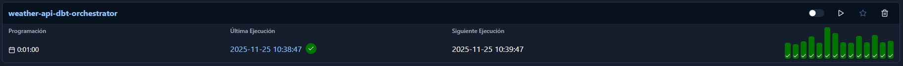
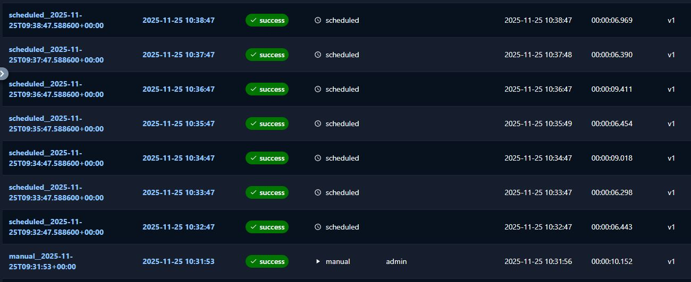
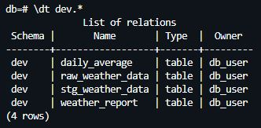
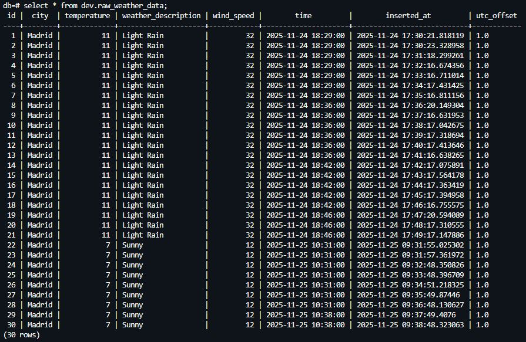
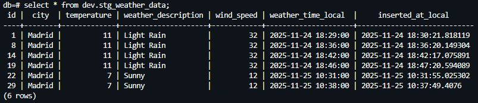
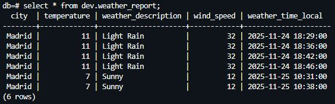
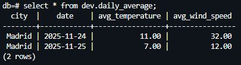

<h1 align="center"> ⛈️ Weather Data Pipeline </h1>

Desarrollo de un pipeline automatizado de datos meteorológicos que extrae información del clima desde la API Weatherstack. Mediante Apache Airflow, los datos se almacenan de forma periódica en una base de datos PostgreSQL, asegurando la actualización continua de la información. Todo el sistema se ejecuta de manera aislada y reproducible dentro de un contenedor Docker, facilitando su despliegue y mantenimiento.

<h2> ● Pasos: </h2>

1. En la terminal introducimos el comando <code>docker-compose up</code>.

2. Acceder a <code>http://localhost:8000/dags/weather-api-orchestrator/runs</code>. 

3. Introducir el usuario <code>admin</code> y la contraseña generada por Airflow.

  

4. Ponemos en funcionamiento nuestro Pipeline. Este se ejecutará de forma automática cada minuto.

  

5. Abrimos una nueva terminal e introducimos el comando <code>docker-compose exec db psql -U db_user -d db</code>.

6. Entramos a la base de datos mediante el comando <code>\c db</code>.

7. Mediante el comando <code>\dt dev.*</code> se listan todas las tablas que se encuentran dentro del esquema <code>dev</code>.

  

- La tabla <code>raw_weather_data</code> contiene la información proveniente directamente de la API.

  

- Mediante <code>dbt</code> se crea la tabla <code>stg_weather_data</code>. A diferencia de la tabla anterior, esta no contiene instancias con el mismo <code>time</code>.

  

- Mediante <code>dbt</code> se crea la tabla <code>weather_report</code>. Esta contiene los atributos más relevantes para la información del tiempo.

  

- Mediante <code>dbt</code> se crea la tabla <code>daily_average</code>. Esta recopila la información media diaria de los atributos <code>temperature</code> y <code>wind_speed</code>.

  

