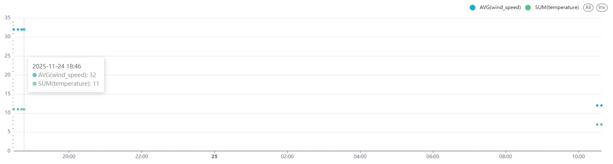

<h1 align="center"> ⛈️ Weather Data Pipeline </h1>

Diseño e implementación de una arquitectura de datos ELT (End-to-End) contenerizada con Docker. El pipeline, orquestado por Apache Airflow, ingesta datos meteorológicos en tiempo real desde la API Weatherstack hacia PostgreSQL. Se utiliza dbt (data build tool) para el modelado de datos, transformando la información extraída de la API en un esquema analítico optimizado (capas staging y mart). Finalmente, los insights se visualizan en un dashboard interactivo mediante Apache Superset, permitiendo el monitoreo continuo de la información.

<h2> ● Pasos: </h2>

1. En la terminal introducimos el comando <code>docker-compose up</code>.

2. Accedemos a <code>http://localhost:8000/dags/weather-api-orchestrator/runs</code>. 

3. Insertamos el usuario <code>admin</code> y la contraseña generada por Airflow.

  

4. Ponemos en funcionamiento nuestro Pipeline. Este se ejecutará de forma automática cada minuto.

  

5. Abrimos una nueva terminal e introducimos el comando <code>docker-compose exec db psql -U db_user -d db</code>.

6. Entramos a la base de datos mediante el comando <code>\c db</code>.

7. Mediante el comando <code>\dt dev.*</code> se listan todas las tablas que se encuentran dentro del esquema <code>dev</code>.

  

8. La tabla <code>raw_weather_data</code> contiene la información extraída de la API.

  

9. dbt:

- staging: Se crea la tabla <code>stg_weather_data</code>, eliminando de <code>raw_weather_data</code> las instancias con el mismo <code>time</code>.

  

- mart: En base a <code>stg_weather_data</code> se crean las tablas <code>weather_report</code> y <code>daily_average</code>, cada una de ellas con un objetivo concreto.

<code>weather_report</code> muestra la información más representativa del tiempo.

  

<code>daily_average</code> recopila la información media diaria de los atributos <code>temperature</code> y <code>wind_speed</code>.

  

10. La información puede visualizarse de manera interactiva gracias a Apache Superset.

11. Accedemos a <code>http://127.0.0.1:8088/superset/welcome/</code>.

12. Introducimos el usuario y la contraseña <code>admin</code>.

12. Podemos ver/crear dashboards para visualizar la información almacenada.

  

